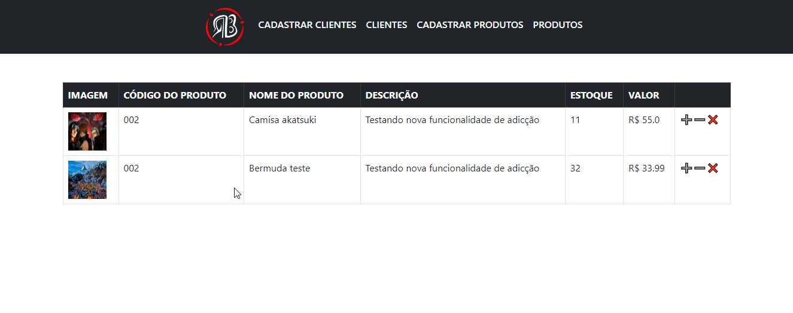
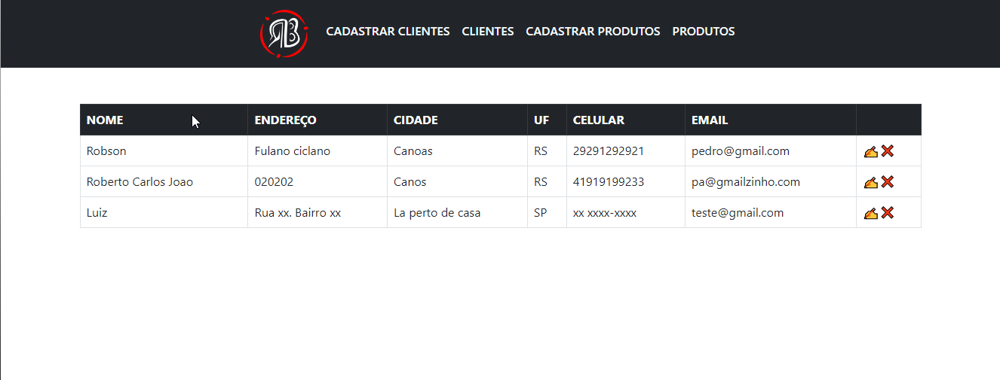

# Sistema de ESTOQUE completo feio em FLASK e PYTHON!
Uma aplicação feita com Python, Flask, MySQL, Jinja, BootStrap5 e HTML5.
Contém as seguintes funcionalidades:

✅ Visualizar os clientes e produtos, editar e deletar, assim como controlar o estoque.

✅ Cadastrar produtos, o sistema automaticamente ira receber e tratar as informações, inclusive fazer upload de qualquer imagem.

✅ Cadastrar clientes, podendo editar e deletar também!

✅ Navbar para facilitar a navegação e design feito em BootStrap.

## Página de produtos

## Página de cadastro de produtos

## Página de clientes

## Página de cadastro de clientes

